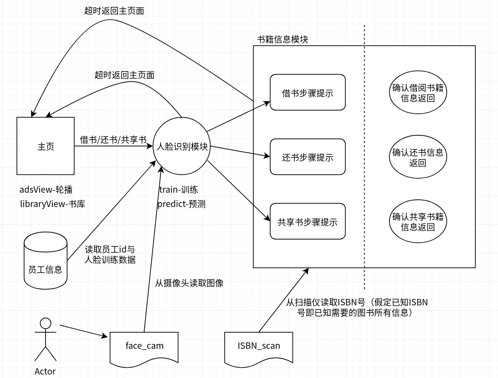

## 任务板

- [x] 环境搭建，确保大家的环境下都能运行程序

  - [x] 安装Qt库与相关环境配置文档
  - [x] 选定人脸识别库与安装，相关环境配置文档的编写

- [x] 主页界面搭建——

  - [x] 图片轮播
  - [x] 书库展示
  - [x] 功能面板

  

- [x] 在库热门书籍推荐——

  - [x] 如果书库中无书籍，则只显示一个添加按钮，点击进入共享书流程；
  - [x] 如果有书籍，根据借书频次与入柜时间维持一个优先级队列，推荐队列前两/几本书籍

- [x] 身份认证模块——

  - [x] 面部扫面页面——圆框人脸图片显示；
  - [x] 面部扫面页面——返回按钮
  - [x] 面部扫面页面——提示按钮
  - [x] 面部扫面页面——识别时的旋转动态效果
  - [x] 面部扫面页面——开启新线程用于识别（因为识别过程需要一定时间，不能在识别的时候卡住整个界面）
  - [x] 身份信息确认页面——信息显示，确认按钮（进入书籍扫描模块），取消按钮（返回主页）

  --------------->

- [ ] 书籍信息模块——

  - [ ] 借书/还书/共享书籍提示页面——页面提示与读取扫描信息（从ISBN_scan文件夹）
  - [ ] 借/还/共享书籍信息确认页面——借阅书籍信息显示；确认按钮更新信息返回主页，再借一本按钮回到上一页（即重新进入书籍扫描模块）

  ----------->

- [ ] 界面逻辑与跳转

  

  - [x] 主页至人脸模块跳转
  - [x] 人脸模块至书籍扫描模块跳转（及超时自动返回）
  - [x] 人脸模块超时自动返回主页面重置状态
  - [ ] 书籍扫描页面超时自动返回主页提示关好柜门重置状态
  - [ ] 正确执行所有流程完成信息更新（员工借阅书籍日志，员工当前持有书籍信息更新，书籍借阅频次信息更新，书籍是否在库信息更新）

- [ ] 数据搜集

  - [ ] demo测试用书籍基本信息：书名（title+edition），作者，封面图，ISBN号（作为书籍的id），简短介绍，入库时间以及累计借用频次（初始为0）
  - [x] demo测试用员工身份信息：名字（虚构），工号（id），训练与测试用人脸数据，（可能的话加上面部视频信息，模拟实际场景中摄像头看到的用户画面）
  - [x] 轮播图片默认图（没有书籍时展示默认图），书库为空时的添加书籍按钮图片
  - [x] 借书、还书、共享书籍按钮图片

- [x] 数据读写模块——

  - [x] 从文件中读取员工所有信息（包括员工人脸训练模型，如果有的话；如果没有，在读取员工人脸数据后训练模型）
  - [x] 读取人脸图片（不再需要）
  - [x] 训练人脸识别模型后保存下次启动时可以直接读取模型，不需要重新训练模型（或者不要这个功能？如果直接训练模型耗时不长）——不需要
  - [x] 读取书籍信息（名称、作者、封面图、ISBN号、简短介绍以及累计借用频次）
  - [x] 读取书籍封面图片
  - [x] 根据借用频次排序（频次相同根据入库时间最近的排前面，排序可使用优先级队列结构，方便动态调整顺序）
  - [x] 关闭程序时保存书籍信息（书籍信息可能在程序运行时发生变更，可能有人共享了书籍，有人借书、还书）

- [x] 人脸识别模块

  - [x] 训练函数，预测函数
  - [x] 调用路径环境配置及配置文档说明

- [ ] 测试模块

  - [ ] 正确员工借书测试
  - [ ] 正确员工还书测试
  - [ ] 正确员工共享书籍测试
  - [ ] 多人脸测试
  - [ ] 查无此人测试

- [ ] demo制作——demo场景模拟：（对测试过程录屏即可）

  - [ ] 主页面借书-->身份识别（从face_cam文件夹读取摄像头图片验证身份）-->扫描书籍信息（从ISBN_scan文件夹读取书籍信息）-->信息确认
  - [ ] 主页面还书-->身份识别-->书籍信息扫描-->信息确认
  - [ ] 主页面共享书籍-->身份识别-->书籍信息扫描-->信息确认

## 目录说明

1. 项目根目录放置项目源代码、Readme.md说明文档以及任务板tasks.md及其他子文件夹
2. 3rdParty——放置第三方库头文件/源文件
3. database——保存数据库中相应的信息，如员工信息，书籍信息，广告等，以文件形式保存
   1. BookImages——书籍封面图，用于显示书籍信息的时候展示，如主页的在库图书，借还书后书籍信息的确认
   2. faces——员工人脸训练数据图片
   3. Carousel——广告轮播图片，需要展示的广告图片放在该文件夹，程序自动读取该文件夹下所有`.jpg`与`.png`文件展示在广告轮播位置
   4. history——保存操作历史，如借阅历史，还书历史，入库书籍记录等
4. face_cam——在进入人脸识别模块时扫面人脸自动从该文件夹下读取图片，测试的时候放置要使用的测试图片，平时不放置文件
5. ISBN_scan——在进入书籍信息识别的时候自动从该文件夹下读取书籍信息文件，测试的时候放置要使用的文本文件，平时不放置
6. icons——放置程序用到的图标文件
7. images——放置说明文档中使用的图片文件
8. tests——放置测试用脚本图片以及步骤说明等

## 开发人员

- WillsonLee
- Liaowangh
- guoxin49
- zlpson

