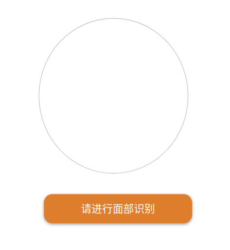
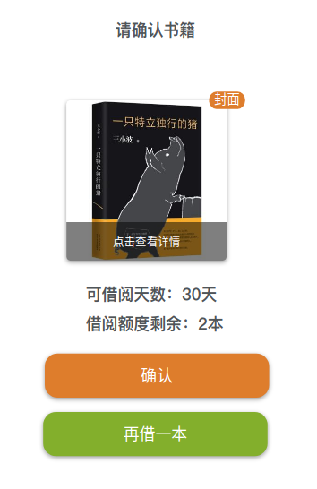

任务与进度安排

--------------------------------------

1. 实现功能（需求分析）

   主页——图片轮播？书库展示？基本功能：借书、还书、书籍入柜、人脸识别；

   

   - 员工信息录入——假定员工信息已存在于数据库中，本界面不进行员工数据录入。

   - 借书

     主页借书--->统一身份识别（人脸识别）界面+个人身份信息确认--->取书指示--->确认信息

     |  |  |
     | :----------------------: | :---------------------: |
     |    |  |

   - 还书

     主页还书--->统一身份认证+信息确认--->还书指示--->确认信息

   - 共享书籍

     主页共享书籍--->统一身份认证+身份信息确认--->书籍扫码贴标签入柜--->（录入书籍信息）--->返回主页（借还书）

     

2. 任务划分

   

3. 开发人员

   

